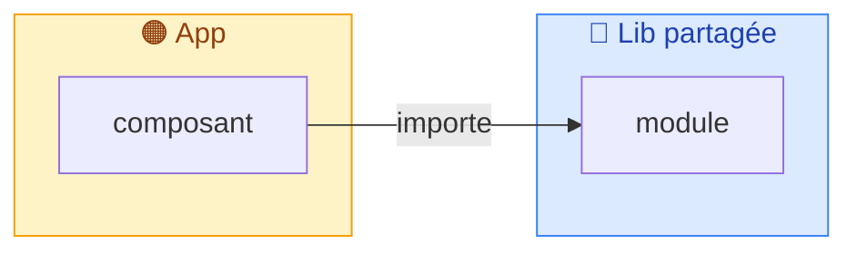

# PR description — house style reference

This is the style guide the `pr-description` skill assembles from. It is distilled from real PRs that
worked well. The north star: **a reviewer should understand *why* the change exists and *what* to look at
before reading a single line of diff.**

## Golden rules

1. **Why before what.** Open with the problem/objective, not a file list.
2. **Name the rejected alternative.** Every non-obvious choice gets a *"X, not Y — because…"*. This is the
   single most valuable thing a description carries.
3. **Adaptive richness.** Match the section set to the size of the change (tiers below). A 3-file fix does
   not need a mermaid diagram; a foundational PR does.
4. **Skimmable.** Emoji headers, short paragraphs, tables over prose, collapsibles for depth.
5. **Real artifacts only.** Code snippets come from the actual diff. Never invent APIs, numbers, or links.

## Title

Conventional commit, scope = the touched package/app:

- `feat(api): socle routes internes /internal + domaine investor (MAR-255…257)`
- `feat(auth): implement better-auth for RNW (native + web)`
- `[M1+M2+M4] BO Projects — boot app + liste projets + échéancier` (milestone-prefixed is fine for big PRs)

## Size tiers — which sections to include

| Tier | Heuristic | Sections |
|---|---|---|
| **Small** | ≈1–5 files, single concern | Title · 🎯 Contexte · _Ce qui change_ (bullets) · ✅ Plan de test · 🔗 Liens |
| **Medium** | several files / one subsystem | + 🏗️ Architecture (overview) · 1 decision table · _Points d'attention reviewer_ |
| **Large / foundational** | many files, new surface, cross-cutting | + ```mermaid``` diagram(s) · `<details>` vertical-slices · ❓ FAQ · 🛣️ Phasage · 🧯 Gotchas · ⚠️ Action requise · screenshots |

Always include: a context section, *what changed*, and a test plan. Everything else is earned by size.

## Section catalog (emoji ↔ purpose)

| Emoji + heading | Purpose |
|---|---|
| 🎯 Contexte & objectif / **Summary** | The *why*. Problem, goal, intended outcome. Often opens with a `> [!NOTE]` stakeholder-validation callout. |
| 🛣️ Phasage | When the work ships in phases — a status table (`Phase \| Périmètre \| Statut`). |
| 🧱 / 🏗️ Architecture | How it's structured. Layer table and/or a mermaid diagram. Pair with ASCII before/after for migrations. |
| 🔄 Le flux | Step-by-step runtime/data flow, often an ASCII or mermaid diagram. |
| 📦 Choix des libs / outils | **Decision table** with rejected alternatives. |
| 🗂️ Arborescence | File-tree code block with inline `← comment` annotations. |
| ❓ FAQ | `<details>` per question — the "why this, not that" deep cuts. |
| ✅ Tests / Plan de test | What's covered, or a `- [ ]` checklist for the reviewer/QA. |
| 🚀 Lancer en local | Prerequisites + commands to run it. |
| 🛠️ DX | Commands table (`Commande \| Usage`). |
| ⚠️ Action requise | Blocking manual steps (secrets, env, CI) — make it impossible to miss. |
| 🧯 Gotchas & maintenance | Traps, fragile spots, upkeep notes. |
| 📐 Conventions & lint | Rules the PR enforces. |
| 👀 Points d'attention pour le reviewer | Where to look first; the risky bits. |
| 🔗 Liens | Linear tickets, docs, related PRs. |

Pick from this menu — do **not** include every section. A good medium PR is 4–6 sections.

## Templates

### Stakeholder-validation callout (top of 🎯, when applicable)

```md
> [!NOTE]
> Approche déjà présentée et validée :
> - **<Nom> (`@handle`) — <rôle>** : <ce qui a été validé>.
```

### Decision table (📦)

```md
| Besoin | Choix | Pourquoi (alternative écartée) |
|---|---|---|
| <besoin> | **<choix>** | <raison> (<alt> : <pourquoi écartée>) |
```

### Architecture layers table (🏗️)

```md
| Couche | Rôle | Où |
|---|---|---|
| **Contrat** | … | `@pkg/...` |
| **Contrôleur** | … | `module/controllers/` |
| **Repository** | … | `module/repositories/` |
```

### Mermaid flowchart (large only) — color-code by package/layer

````md

````

### ASCII before/after (migrations)

````md
### Avant
```
OldFlow ─► step ─► result
```
### Après
```
NewFlow ─► step ─► result
```
````

### Vertical-slice in a collapsible (large only)

````md
<details>
<summary><b>1 · Contrat</b></summary>

```ts
// real snippet from the diff
```
</details>
````

### Arborescence (🗂️)

````md
```
projects/api/
├─ src/<module>/__tests__/<feature>.test.ts   ← colocalisé avec la prod
└─ tests/integration/
   ├─ core/                                    ← entrées
   └─ helpers/                                 ← req(), resetAll()
```
````

### Test-plan checklist (✅)

```md
- [ ] **<Domaine>** — <scénario à vérifier>
- [ ] **<Domaine>** — <scénario à vérifier>
```

### Scope line

```md
`+4757 / −567`, 86 fichiers. Découpage : …
```

## Condensed skeletons

### FR — medium PR

```md
feat(scope): <titre court>

## 🎯 Contexte & objectif
<Le problème, ce qui le déclenche, le résultat visé. 2–4 phrases.>

## 🏗️ Architecture
<Vue d'ensemble : table de couches ou court paragraphe. Mermaid si la surface le justifie.>

## Ce qui change
- **<zone>** — <quoi + pourquoi>
- **<zone>** — <quoi + pourquoi>

## 📦 Choix techniques
| Besoin | Choix | Pourquoi (alternative écartée) |
|---|---|---|
| … | **…** | … |

## 👀 Points d'attention pour le reviewer
1. **<sujet>** — <où regarder, pourquoi c'est délicat>

## ✅ Plan de test
- [ ] <scénario>

## 🔗 Liens
- Linear : <BRI-xxx>
```

### EN — medium PR

```md
feat(scope): <short title>

## 🎯 Context & goal
<The problem, what prompted it, the intended outcome. 2–4 sentences.>

## 🏗️ Architecture
<Overview: layer table or short paragraph. Mermaid only if the surface warrants it.>

## What changed
- **<area>** — <what + why>
- **<area>** — <what + why>

## 📦 Technical choices
| Need | Choice | Why (rejected alternative) |
|---|---|---|
| … | **…** | … |

## 👀 Reviewer focus
1. **<topic>** — <where to look, why it's delicate>

## ✅ Test plan
- [ ] <scenario>

## 🔗 Links
- Linear: <BRI-xxx>
```

## Don'ts

- Don't open with "This PR adds…/Cette PR ajoute…" file lists — lead with the *why*.
- Don't include empty ceremony sections. Omit a section rather than fill it with filler.
- Don't invent rationale. If the *why* for a choice is unknown, ask the user or leave it out.
- Don't paste the entire diff. Use file-tree + targeted snippets + collapsibles.
